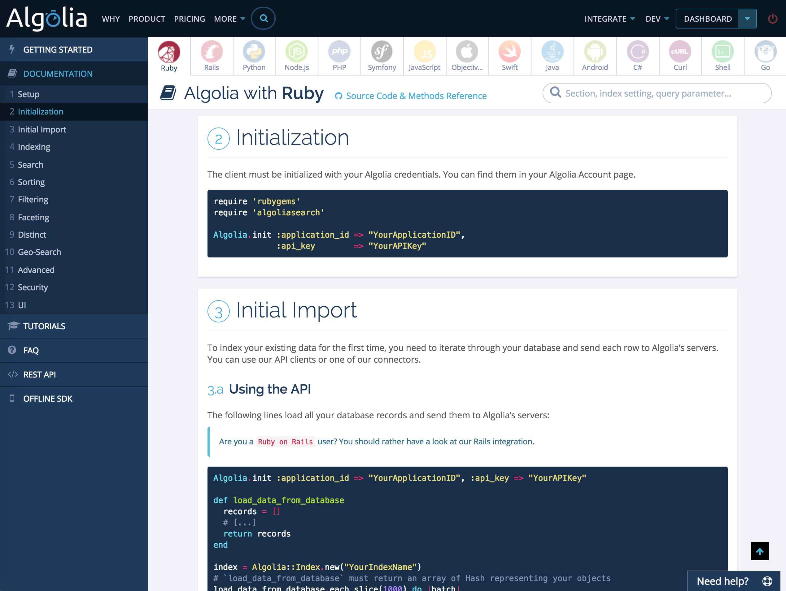

# Documentation Editor

This is the mountable Rails application providing the documentation editor of [algolia.com/doc](https://www.algolia.com/doc).

The goal of this project is to provide an easy & frictionless way to edit an online documentation. The sweet spot of this editor is to be able to generate pages containing multiple snippets of highlighted code & conditional sections (which wasn't really available in any other CMS we considered). It also includes a nice image uploader storing the image to Amazon S3, a simple table editor and an automatic table of content generator.

## Features

 - Widgets
   - Text: Full markdown support
   - Callout: info/warning/danger
   - Tables: customizable number of columns & rows
   - Code: code snippet with highlighting
   - Conditions: ability to display some sections based on some query parameters
   - Image: image uploader + ability to store on S3
 - Caching
 - Automatic TOC generation (anchors are automatically generated on each title)
 - Raw edition mode
 - Administration restricted access
 - Undo
 - Versionning
 - Diff

## Installation

#### Dependencies

Your project needs to depend on the following libraries:

 * Angular.js,
 * ng-file-upload.js,
 * Bootstrap 3,
 * and Fontawesome 4.


This project depends on:

 * rails (> 4.0),
 * haml-rails,
 * sass-rails,
 * kramdown,
 * highlight,
 * simple_form,
 * sass-rails,
 * and paperclip.


#### Setup

To use it in your own Rails project, do the following steps:

 * Add the `documentation_editor` gem to your `Genfile`

 * Mount the provided routes adding the following `Engine` to your `config/routes.rb` file:

```ruby
Rails.application.routes.draw do
  #
  # [ ... ]
  #
  mount DocumentationEditor::Engine => "/doc"
end
```

 * Add the following dependency in your `application.js`:

```js
// Make sure you've required `jquery`, `angular` and `ng-file-upload` before
//
//= require documentation_editor/pages
```

 * Add the following dependency in your `application.css`:

 ```css
/*
 * Make sure you've required `bootstrap` before
 *
 *= require documentation_editor/pages
 */
 ```

 * Go to `/doc/admin` to create your first page

## Configuration

Create a `config/initializers/documentation_editor.rb` file to configure the editor:

```ruby
# to use a custom layout
DocumentationEditor::Config.layout = 'my_custom_layout'

# to protect the access to the edition pages to admin
DocumentationEditor::Config.is_admin = :method_checking_if_admin?

# to use custom options for paperclip
DocumentationEditor::Config.paperclip_options = {
  storage: 's3',
  s3_credentials: { bucket: 'xxx', access_key_id: 'xxx', secret_access_key: 'xxx' },
  s3_host_alias: 'xxxxxxxxxx.cloudfront.net',
  url: ':s3_alias_url',
  path: ':attachment/:id/:style.:extension'
}

# to wrap your h1 sections with `<section>` tags
DocumentationEditor::Config.wrap_h1_with_sections = true
```

## Markdown Extensions

#### Language conditions

You can force a page to only display a specific language. To force the language of a page, you need to set the `language` query parameter. We recommend inlining those parameters directly from your `routes.rb` file:

```ruby
Rails.application.routes.draw do
  get '/doc/ruby', :controller => 'pages', :action => 'show', slug: 'guide', language: 'ruby'
  mount DocumentationEditor::Engine => "/doc"
end
```

Use `[[LANGUAGE]] ... [[/LANGUAGE]]` to only display a piece of text if this is the current language. For instance:

```html
[[ruby]]This will only be displayed if languag=ruby[[/ruby]] but this will be always displayed.
```

If you want a tab of your code snippet to be displayed whatever the language, you can use the special `*` language name. For instance, this JavaScript snippet will be displayed whatever the language specified:


#### Variables

```ruby
Rails.application.routes.draw do
  get '/doc/ruby', :controller => 'pages', :action => 'show', slug: 'my_page', variables: { name: 'Foo' }
  mount DocumentationEditor::Engine => "/doc"
end
```

Use `[[variable:VARIABLE]]` and specify any variables you want to display their values. For instance:

```html
This is the value of the `name` variable: [[variable:name]].
```

## Usage

Create your first page from the `/doc/admin` URL.


This is what the previous code generates:


And this is what it looks like once styled:



What the history/diff looks like:


## Development

```sh
$ bundle install
$ cd test/dummy
$ rake documentation_editor:install:migrations
$ rake db:migrate
$ rails server
$ open http://localhost:3000/doc/admin
```
